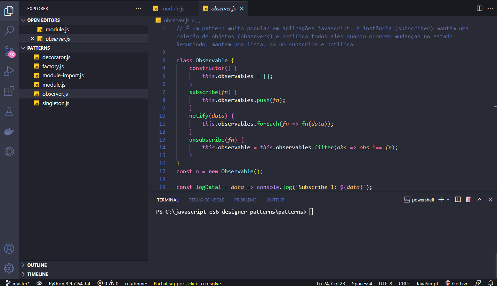

<h1 align="center">
  
   
  JavaScript ES6 - Designer Patterns
</h1>

<h3 align="justify">
Didactic demonstration of the main JavaScripty ES6 designer patterns. Credits for the Digital Innovation One Essential ES6 JavaScript module.
</h3>

 

## 📷 Demonstration

<h4 align="left"> Decorator </h4>
  
   
<h4 align="left" > Factory </h4>  
  
   
<h4 align="left"> Import </h4>
  
   
<h4 align="left"> Observer </h4>
  
   
<h4 align="left"> Singleton </h4>
  
   

 

## 🚀 Technologies

This project was developed with the following technologies:

- JavaScript ES6
- NodeJS

 

## ⚙ Operators
- decorator
- factory
- import
- observer
- singleton

 

---

Made with 💜 by Rafael Maciel
